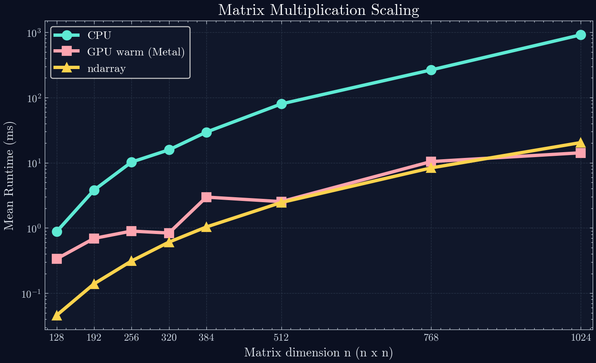
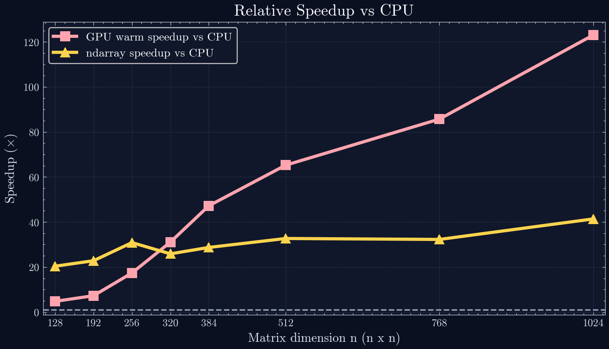

# Matrix Scaling Benchmarks

- Generated: 2026-02-28 22:50:17 UTC
- Bench suite: `matrix_scaling`
- Metric: Criterion mean runtime (plots show mean lines; 95% CI is in the table)

## n = 128

| backend | μ ± 95% CI | σ | speedup vs cpu |
| --- | --- | ---: | ---: |
| cpu | 814.911 µs ± 2.504 µs | 7.138 µs | 1.000x |
| gpu | 1.862 ms ± 40.921 µs | 115.784 µs | 0.438x |
| ndarray | 41.533 µs ± 76.781 ns | 221.822 ns | 19.621x |

## n = 192

| backend | μ ± 95% CI | σ | speedup vs cpu |
| --- | --- | ---: | ---: |
| cpu | 3.066 ms ± 7.111 µs | 20.245 µs | 1.000x |
| gpu | 2.014 ms ± 35.047 µs | 100.056 µs | 1.523x |
| ndarray | 137.127 µs ± 5.843 µs | 16.830 µs | 22.362x |

## n = 256

| backend | μ ± 95% CI | σ | speedup vs cpu |
| --- | --- | ---: | ---: |
| cpu | 22.569 ms ± 5.589 ms | 16.123 ms | 1.000x |
| gpu | 2.379 ms ± 307.805 µs | 885.430 µs | 9.485x |
| ndarray | 659.933 µs ± 21.569 µs | 61.939 µs | 34.200x |

## n = 320

| backend | μ ± 95% CI | σ | speedup vs cpu |
| --- | --- | ---: | ---: |
| cpu | 49.869 ms ± 11.841 ms | 33.763 ms | 1.000x |
| gpu | 3.719 ms ± 292.057 µs | 832.092 µs | 13.409x |
| ndarray | 1.043 ms ± 18.277 µs | 53.059 µs | 47.816x |

## n = 384

| backend | μ ± 95% CI | σ | speedup vs cpu |
| --- | --- | ---: | ---: |
| cpu | 48.718 ms ± 855.445 µs | 2.446 ms | 1.000x |
| gpu | 4.694 ms ± 211.555 µs | 602.178 µs | 10.378x |
| ndarray | 1.581 ms ± 10.834 µs | 30.690 µs | 30.814x |

## n = 512

| backend | μ ± 95% CI | σ | speedup vs cpu |
| --- | --- | ---: | ---: |
| cpu | 138.524 ms ± 1.012 ms | 2.857 ms | 1.000x |
| gpu | 8.040 ms ± 1.509 ms | 4.319 ms | 17.229x |
| ndarray | 3.938 ms ± 77.988 µs | 221.378 µs | 35.180x |

## n = 768

| backend | μ ± 95% CI | σ | speedup vs cpu |
| --- | --- | ---: | ---: |
| cpu | 503.354 ms ± 25.265 ms | 72.238 ms | 1.000x |
| gpu | 12.073 ms ± 1.381 ms | 3.921 ms | 41.691x |
| ndarray | 13.900 ms ± 335.945 µs | 952.203 µs | 36.211x |

## n = 1024

| backend | μ ± 95% CI | σ | speedup vs cpu |
| --- | --- | ---: | ---: |
| cpu | 1530.744 ms ± 179.010 ms | 514.824 ms | 1.000x |
| gpu | 25.264 ms ± 2.267 ms | 6.431 ms | 60.591x |
| ndarray | 32.273 ms ± 483.631 µs | 1.379 ms | 47.431x |

_Lower runtime is faster._
