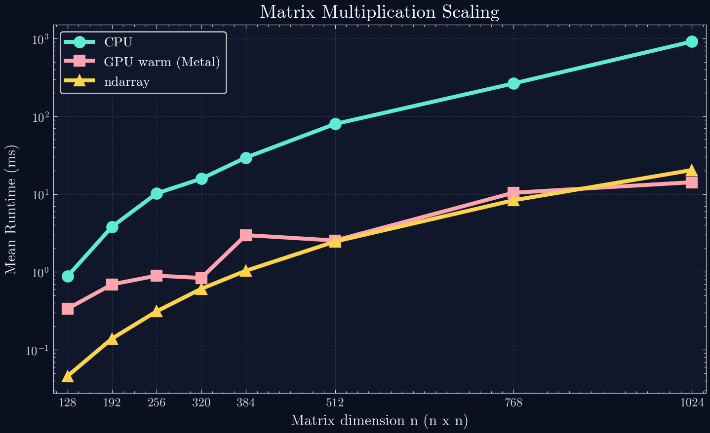
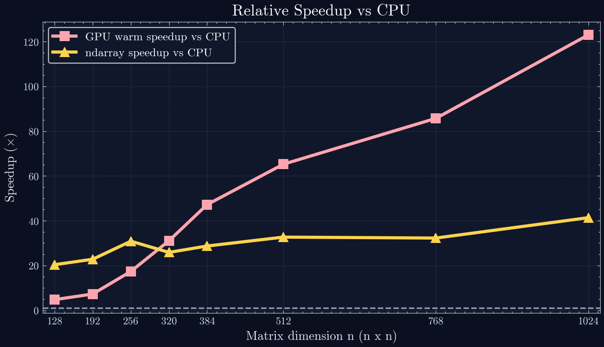

# Matrix Scaling Benchmarks

- Generated: 2026-03-15 16:05:13 UTC
- Bench suite: `matrix_scaling`
- Metric: Criterion mean runtime (plots show mean lines; 95% CI is in the table)

## n = 128

| backend | μ ± 95% CI | σ | speedup vs cpu |
| --- | --- | ---: | ---: |
| cpu | 878.863 µs ± 17.498 µs | 59.163 µs | 1.000x |
| gpu warm | 184.240 µs ± 4.545 µs | 14.313 µs | 4.770x |
| ndarray | 43.115 µs ± 84.307 ns | 239.767 ns | 20.384x |

## n = 192

| backend | μ ± 95% CI | σ | speedup vs cpu |
| --- | --- | ---: | ---: |
| cpu | 3.133 ms ± 32.306 µs | 108.109 µs | 1.000x |
| gpu warm | 430.251 µs ± 12.135 µs | 34.643 µs | 7.281x |
| ndarray | 137.347 µs ± 1.532 µs | 4.362 µs | 22.809x |

## n = 256

| backend | μ ± 95% CI | σ | speedup vs cpu |
| --- | --- | ---: | ---: |
| cpu | 9.624 ms ± 21.945 µs | 62.572 µs | 1.000x |
| gpu warm | 553.667 µs ± 68.863 µs | 195.917 µs | 17.383x |
| ndarray | 311.880 µs ± 627.905 ns | 1.795 µs | 30.859x |

## n = 320

| backend | μ ± 95% CI | σ | speedup vs cpu |
| --- | --- | ---: | ---: |
| cpu | 15.522 ms ± 36.042 µs | 102.705 µs | 1.000x |
| gpu warm | 499.497 µs ± 38.435 µs | 113.759 µs | 31.075x |
| ndarray | 599.959 µs ± 1.184 µs | 3.449 µs | 25.872x |

## n = 384

| backend | μ ± 95% CI | σ | speedup vs cpu |
| --- | --- | ---: | ---: |
| cpu | 29.563 ms ± 270.934 µs | 810.961 µs | 1.000x |
| gpu warm | 626.201 µs ± 4.360 µs | 12.389 µs | 47.210x |
| ndarray | 1.029 ms ± 2.347 µs | 6.732 µs | 28.716x |

## n = 512

| backend | μ ± 95% CI | σ | speedup vs cpu |
| --- | --- | ---: | ---: |
| cpu | 79.526 ms ± 406.056 µs | 1.164 ms | 1.000x |
| gpu warm | 1.219 ms ± 9.491 µs | 26.772 µs | 65.255x |
| ndarray | 2.433 ms ± 5.654 µs | 16.123 µs | 32.689x |

## n = 768

| backend | μ ± 95% CI | σ | speedup vs cpu |
| --- | --- | ---: | ---: |
| cpu | 264.736 ms ± 2.353 ms | 6.707 ms | 1.000x |
| gpu warm | 3.088 ms ± 26.967 µs | 77.219 µs | 85.719x |
| ndarray | 8.204 ms ± 50.165 µs | 144.413 µs | 32.268x |

## n = 1024

| backend | μ ± 95% CI | σ | speedup vs cpu |
| --- | --- | ---: | ---: |
| cpu | 838.601 ms ± 7.721 ms | 21.971 ms | 1.000x |
| gpu warm | 6.817 ms ± 233.545 µs | 660.536 µs | 123.021x |
| ndarray | 20.268 ms ± 151.911 µs | 430.855 µs | 41.376x |

_Lower runtime is faster._
